# Итоговый проект. Разработка и развертывание ИИ-приложения в Kubernetes

**Дисциплина:** Оркестрация и контейнеризация  
**Проект (экзамен):** Разработка и развёртывание ИИ‑приложения в Kubernetes  
**Студент:** Березняк В.Н., гр. М24-535  
**Среда выполнения:** Ubuntu 22.04.5 LTS (VMware Workstation) + VS Code (Windows 11, Remote‑SSH)  
**Дата:** 29.12.2025  

---

## Структура репозитория

```
.
├── Report. Development and deployment AI in k8s.pdf
├── README.md
├── app/
│   ├── SentimentApplication.java
│   └── Dockerfile
├── k8s/
│   ├── deployment.yaml
│   ├── service.yaml
│   ├── ingress.yaml
│   ├── hpa.yaml
│   └── service-monitor.yaml
└── screenshots/
    ├── 01_vm/
    ├── 02_remote_ssh/
    ├── 03_minikube/
    ├── 04_docker/
    ├── 05_k8s/
    └── 06_monitoring/
```

---

# 1. Введение

## 1.1. Цель и задачи проекта

Цель проекта — продемонстрировать полный цикл разработки, контейнеризации и развертывания Java‑приложения с простым анализом тональности текста в локальном кластере Kubernetes (Minikube), а также показать базовую интеграцию с системой мониторинга Prometheus + Grafana.

Задачи:

1. Разработать простое Java‑приложение с REST API:
   - эндпоинт `GET /api/sentiment?text=...`, возвращающий JSON с оценкой тональности;
   - эндпоинт `GET /health` для проверки здоровья;
   - эндпоинт `GET /metrics` в формате Prometheus для сбора метрик.
2. Упаковать приложение в Docker‑образ размером менее 150 МБ (multi‑stage build).
3. Развернуть приложение в Kubernetes (Minikube) с:
   - Deployment минимум на 3 реплики;
   - Service типа `LoadBalancer`;
   - Ingress для маршрутизации запросов на `/api` и `/health`;
   - HPA (Horizontal Pod Autoscaler) по CPU.
4. Настроить мониторинг:
   - установка Prometheus + Grafana через Helm (`kube-prometheus-stack`);
   - подключение приложения через `ServiceMonitor`.
5. Подготовить раздел анализа тенденций по статьям arXiv (будет доработан отдельно).

## 1.2. Используемый технологический стек

| Компонент | Технология |
|---|---|
| Язык/Runtime | Java SE 17 |
| REST | `com.sun.net.httpserver.HttpServer` |
| Контейнеризация | Docker |
| Оркестрация | Kubernetes (Minikube) |
| Управление | `kubectl` |
| Мониторинг | Prometheus + Grafana (`kube-prometheus-stack`) |
| Балансировка | Service (LoadBalancer) + Ingress |
| Масштабирование | HPA по CPU |

## 1.3. Среда выполнения

- Ubuntu 22.04.5 LTS (виртуальная машина в VMware Workstation). См. в папке `screenshots/01_vm`
- На хосте Windows 11: VS Code + расширения Remote Development / Remote‑SSH. См. в папке `screenshots/02_remote_ssh`
- Минимальные ресурсы VM (рекомендация): 4 vCPU, 8+ GB RAM, 20+ GB диск

---

# 2. Архитектура решения

## 2.1. Логическая схема

Компоненты решения:

1. **Sentiment API (Java‑приложение)**
   - `/api/sentiment` — анализ тональности;
   - `/health` — health‑проверка;
   - `/metrics` — метрики в формате Prometheus.
2. **Kubernetes Deployment**
   - 3 реплики Pod’ов с контейнером `sentiment-app`;
   - probes (liveness/readiness), requests/limits.
3. **Service (`LoadBalancer`)**
   - единая точка входа и балансировка по репликам.
4. **Ingress**
   - маршрутизация HTTP на `/api` и `/health`.
5. **HPA**
   - автоскейлинг по CPU (3…10 реплик).
6. **Prometheus + Grafana**
   - сбор метрик Kubernetes и приложения через `ServiceMonitor`;
   - визуализация в Grafana.


---

# 3. Развёртывание инфраструктуры Minikube

## 3.1. Установка Minikube и kubectl

### 3.1.1. Установка Minikube

```bash
curl -LO https://storage.googleapis.com/minikube/releases/latest/minikube-linux-amd64
sudo install minikube-linux-amd64 /usr/local/bin/minikube

minikube version
```

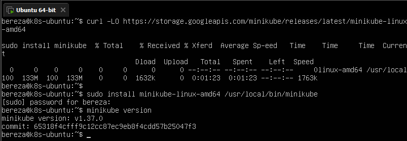

### 3.1.2. Установка kubectl

```bash
curl -LO "https://dl.k8s.io/release/$(curl -L -s https://dl.k8s.io/release/stable.txt)/bin/linux/amd64/kubectl"
sudo install -o root -g root -m 0755 kubectl /usr/local/bin/kubectl

kubectl version --client
```

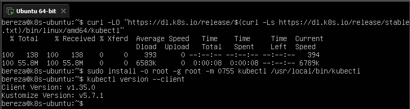

## 3.2. Создание кластера Minikube

Запуск кластера:

```bash
minikube start --cpus=4 --memory=6144mb --nodes=2
```

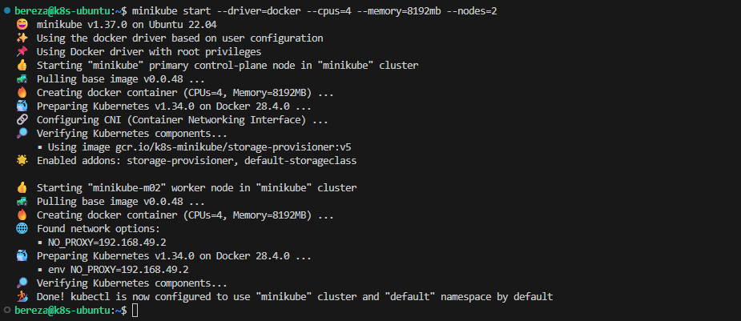

Проверка статуса, нодов и подов:

```bash
minikube status
kubectl get nodes -o wide
kubectl get pods -A
```

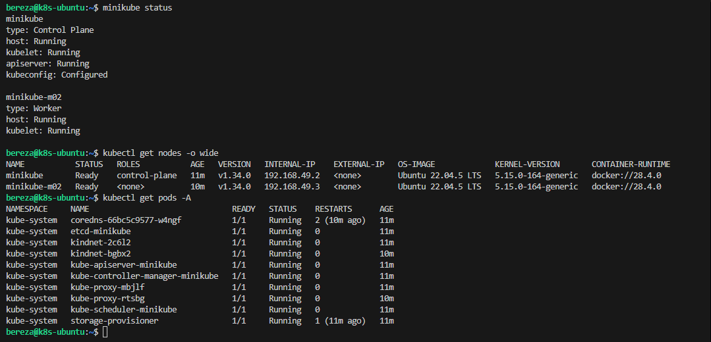

## 3.3. Включение необходимых аддонов

Для работы Ingress и HPA включаю аддоны `ingress` и `metrics-server`:

```bash
minikube addons enable ingress
minikube addons enable metrics-server

minikube addons list | egrep 'ingress|metrics-server'
```

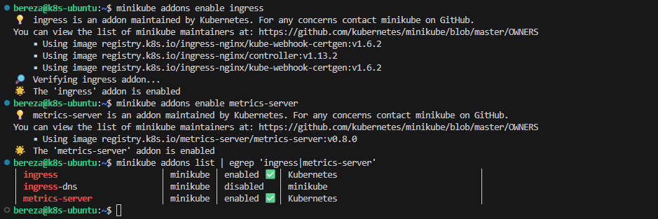

Для доступа к сервисам типа `LoadBalancer` использую:

```bash
minikube tunnel
```

> `minikube tunnel` нужно держать запущенным в отдельном терминале.

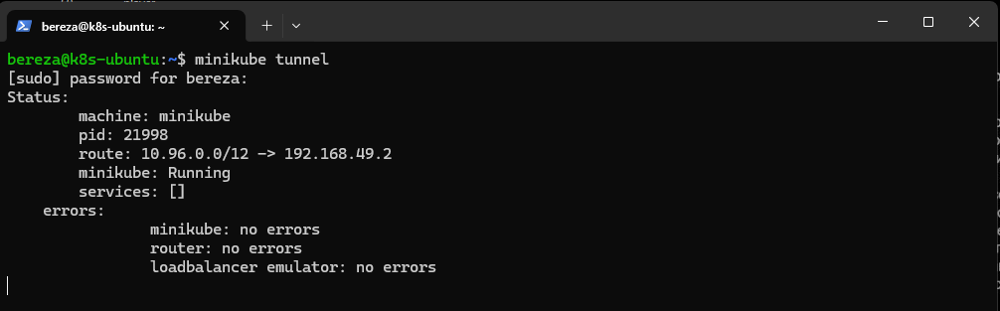

---

# 4. Контейнеризация Java‑приложения

## 4.1. Реализация REST‑API анализа тональности

Приложение написано на Java SE 17 (без Spring), через `com.sun.net.httpserver.HttpServer`.

Эндпоинты:

- `GET /api/sentiment?text=...` → JSON с тональностью и score
- `GET /health` → `{"status":"UP"}`
- `GET /metrics` → метрика `sentiment_requests_total` (Prometheus text format)

Код приложения находится в файле:  
- `app/SentimentApplication.java`

## 4.2. Dockerfile и multi‑stage build

Dockerfile с multi‑stage сборкой и `jlink` для минимального JRE:  
- `app/Dockerfile`

## 4.3. Сборка и локальное тестирование образа

Сборка образа:

```bash
cd final-k8s-sentiment-template/app
docker build -t sentiment-app:1.0 .
docker images sentiment-app:1.0
```

Убедимся, что размер <150 MB

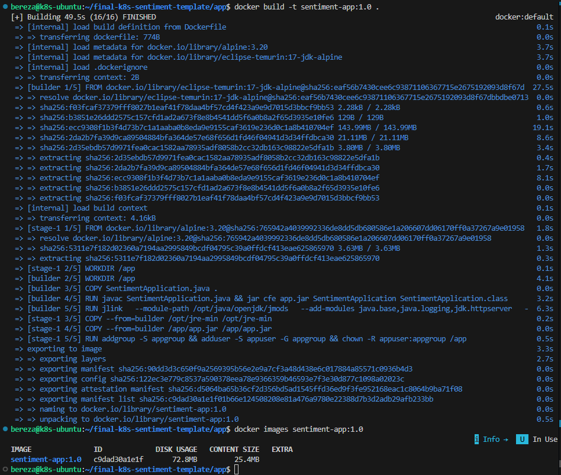

Локальный запуск:

```bash
docker run --rm -p 8080:8080 --name sentiment-test sentiment-app:1.0
```

Проверка эндпоинтов (в другом терминале):

```bash
curl "http://localhost:8080/api/sentiment?text=I+love+Kubernetes"
curl "http://localhost:8080/health"
curl "http://localhost:8080/metrics"
```

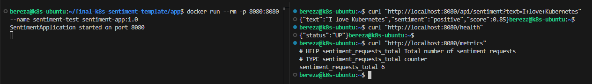

## 4.4. Загрузка образа в Minikube (multi-node)

Кластер Minikube запущен с 2 нодами, поэтому `minikube docker-env` не применяется.  
Для доставки образа в кластер используется команда `minikube image load`.

```bash
cd ~/final-k8s-sentiment-template/app
minikube image load sentiment-app:1.0
minikube image ls | grep sentiment-app
```

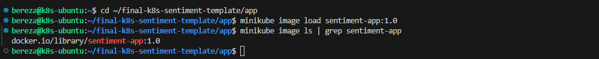

---

# 5. Развёртывание приложения в Kubernetes

## 5.1. Kubernetes‑манифесты

Файлы лежат в папке `k8s/`:

1. `k8s/deployment.yaml` — Deployment (3 реплики) + ServiceAccount.
2. `k8s/service.yaml` — Service `LoadBalancer`.
3. `k8s/ingress.yaml` — Ingress.
4. `k8s/hpa.yaml` — HPA по CPU.
5. `k8s/service-monitor.yaml` — ServiceMonitor для Prometheus.

## 5.2. Применение манифестов

```bash
kubectl apply -f k8s/deployment.yaml
kubectl apply -f k8s/service.yaml
kubectl apply -f k8s/ingress.yaml
kubectl apply -f k8s/hpa.yaml

kubectl get deployments
kubectl get pods -o wide
kubectl get svc
kubectl get ingress
kubectl get hpa
```

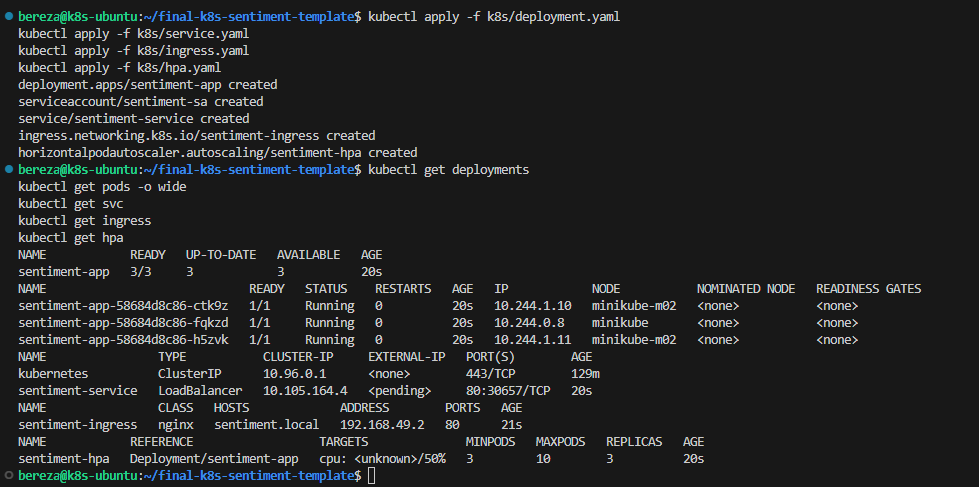

## 5.3. Тестирование доступа к приложению

### 5.3.1. Через port‑forward

```bash
kubectl port-forward svc/sentiment-service 8080:80
curl "http://localhost:8080/api/sentiment?text=I+like+Kubernetes"
```

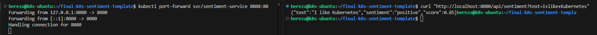

### 5.3.2. Через Ingress

После настройки /etc/hosts и запуска minikube tunnel:

```bash
curl "http://sentiment.local/api/sentiment?text=hello"
curl "http://sentiment.local/health"
```

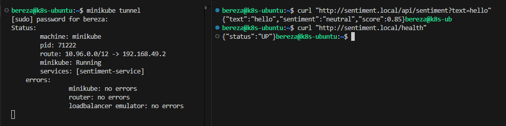

## 5.4. Проверка работы HPA

Создаю нагрузку:

```bash
cd ~/final-k8s-sentiment-template/app
kubectl run load-generator --image=busybox --restart=Never -- /bin/sh -c 'while true; do wget -q -O- http://sentiment-service/api/sentiment?text=load; done'
```

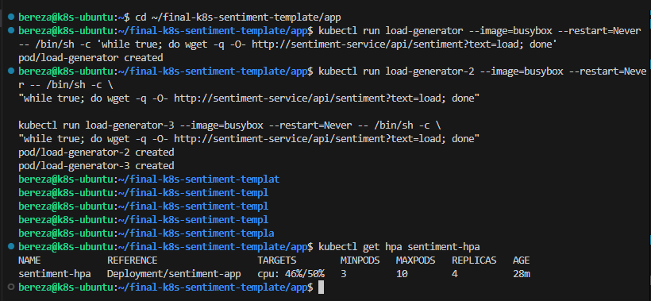

Слежение за масштабированием:

```bash
kubectl get hpa -w
kubectl get pods -w
```

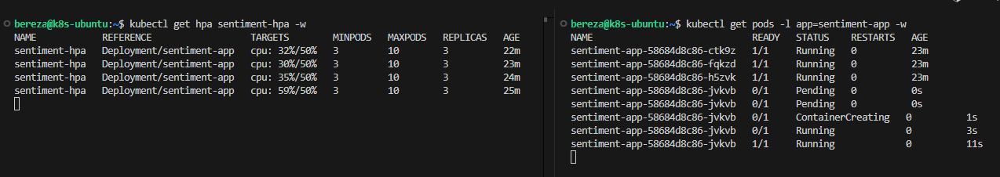

---

# 6. Мониторинг: Prometheus и Grafana

## 6.1. Установка Helm и kube‑prometheus‑stack

### 6.1.1. Установка Helm

```bash
curl https://raw.githubusercontent.com/helm/helm/main/scripts/get-helm-3 | bash
helm version
```

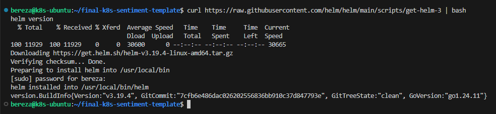

### 6.1.2. Установка стека мониторинга

```bash
helm repo add prometheus-community https://prometheus-community.github.io/helm-charts
helm repo update

kubectl create namespace monitoring

helm install prometheus prometheus-community/kube-prometheus-stack   --namespace monitoring   --set prometheus.prometheusSpec.serviceMonitorSelectorNilUsesHelmValues=false   --set grafana.adminPassword=admin123   --wait
```

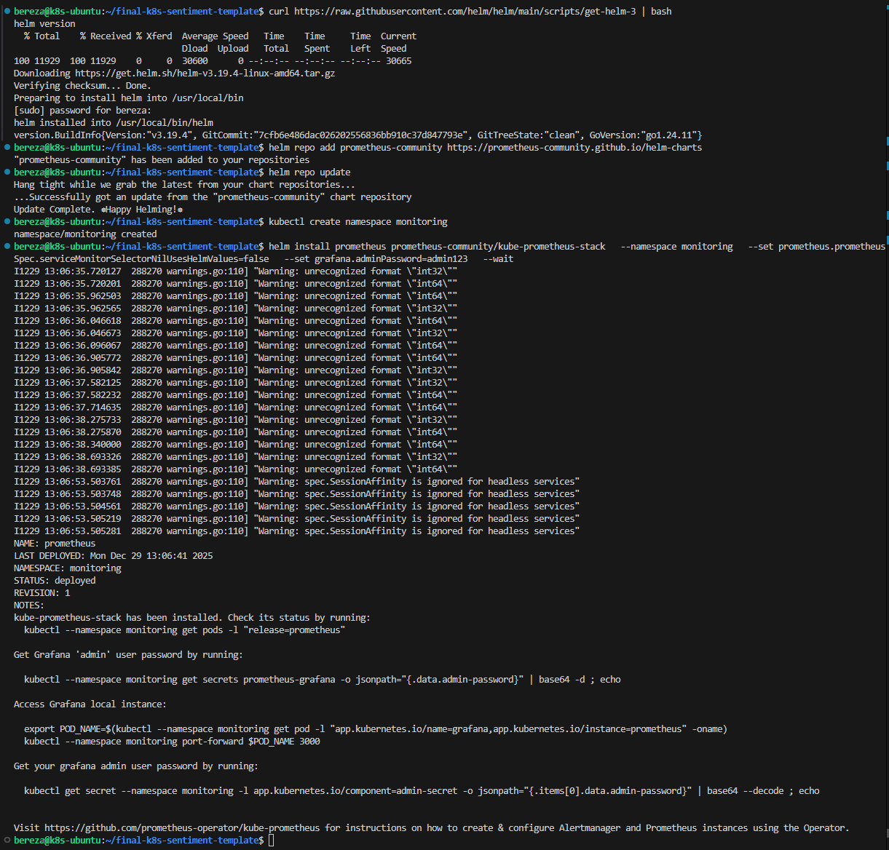

Проверка:

```bash
helm list -n monitoring
kubectl get pods -n monitoring
kubectl get svc -n monitoring
```

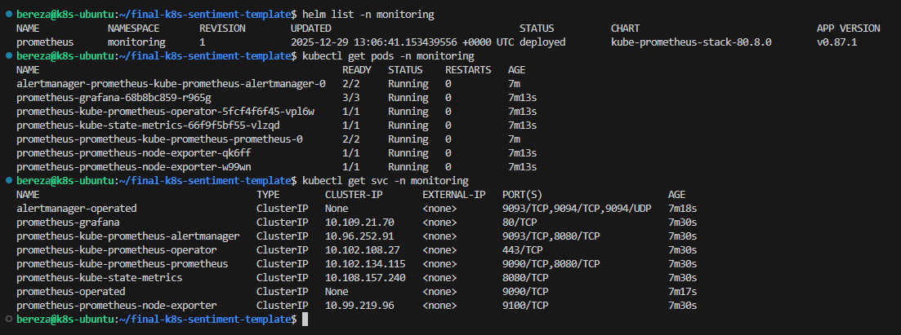

## 6.2. Подключение приложения к Prometheus (ServiceMonitor)

Применяю `ServiceMonitor`:

```bash
kubectl apply -f k8s/service-monitor.yaml
kubectl get servicemonitor -A
```

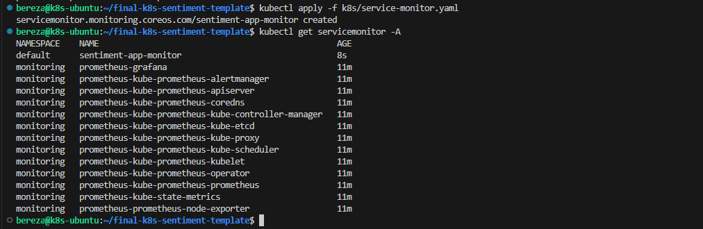

## 6.3. Доступ к Prometheus и Grafana

```bash
kubectl port-forward -n monitoring svc/prometheus-kube-prometheus-prometheus 9090:9090 &
kubectl port-forward -n monitoring svc/prometheus-grafana 3000:80 &
```

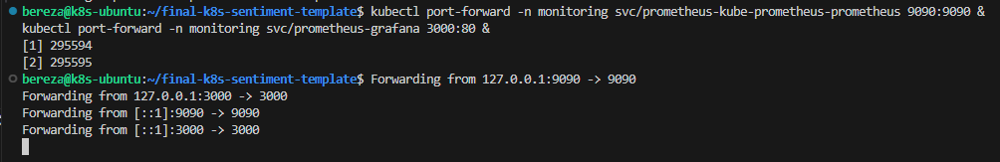

Так как port-forward выполняется внутри Ubuntu-ВМ, для открытия интерфейсов с хостовой Windows нужен SSH-туннель:

```bash
ssh -L 3000:127.0.0.1:3000 -L 9090:127.0.0.1:9090 bereza@192.168.112.128
```

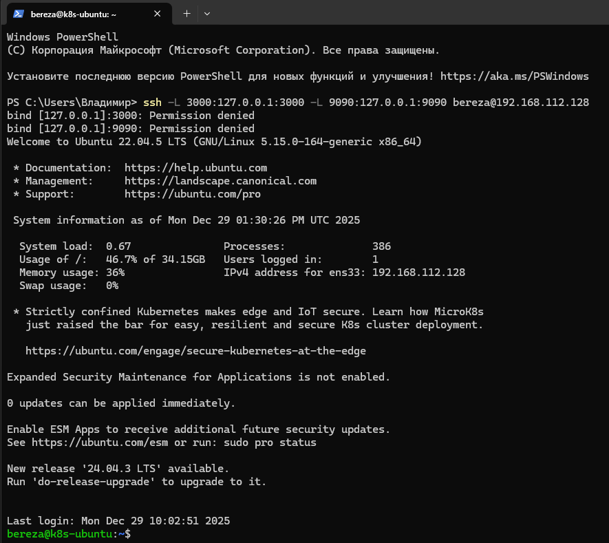

- Prometheus: http://localhost:9090
- Grafana: http://localhost:3000 (логин `admin`, пароль `admin123`)

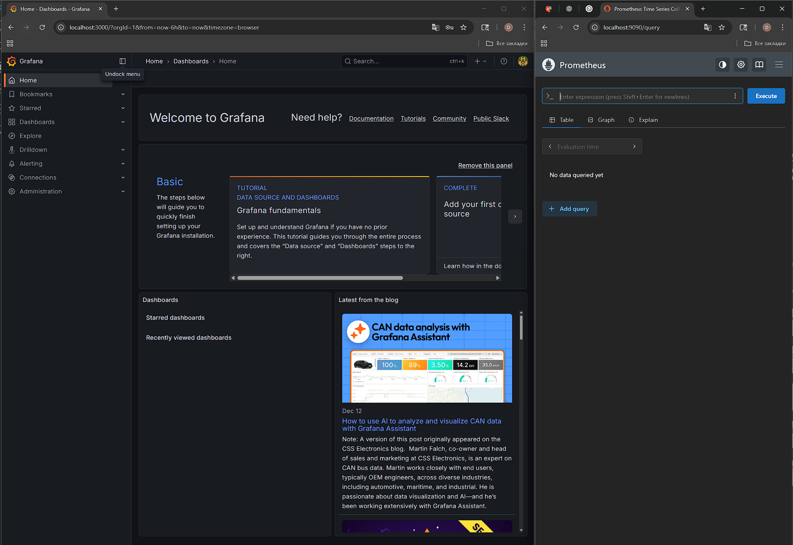

## 6.4. Настройка Grafana и дашборд

### 6.4.1. Data Source Prometheus

1. `Connections → Data sources → Add data source`
2. Prometheus
3. URL: `http://prometheus-kube-prometheus-prometheus:9090`
4. `Save & Test`

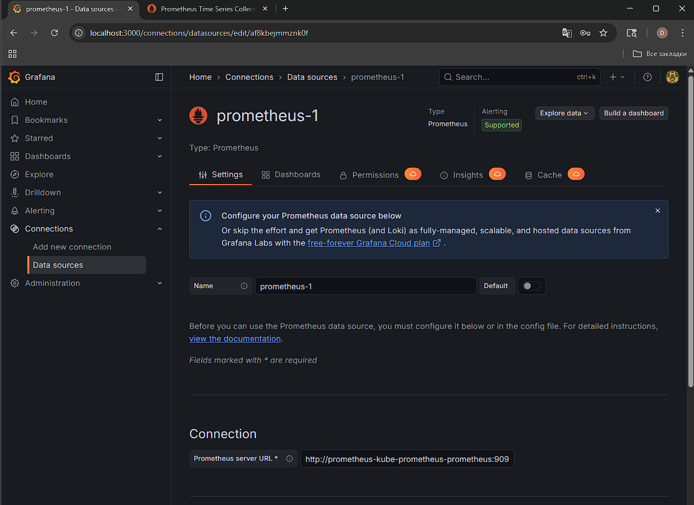
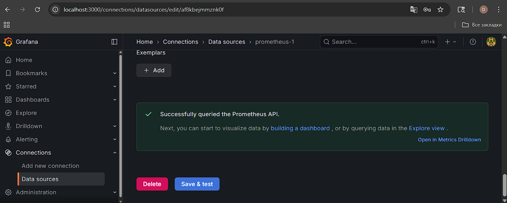


### 6.4.2. Дашборд

Панели:

- график `sentiment_requests_total` (по времени)
- графики `container_cpu_usage_seconds_total, container_memory_usage_bytes` (CPU/Memory по pod’ам)
- панель статусов pod’ов

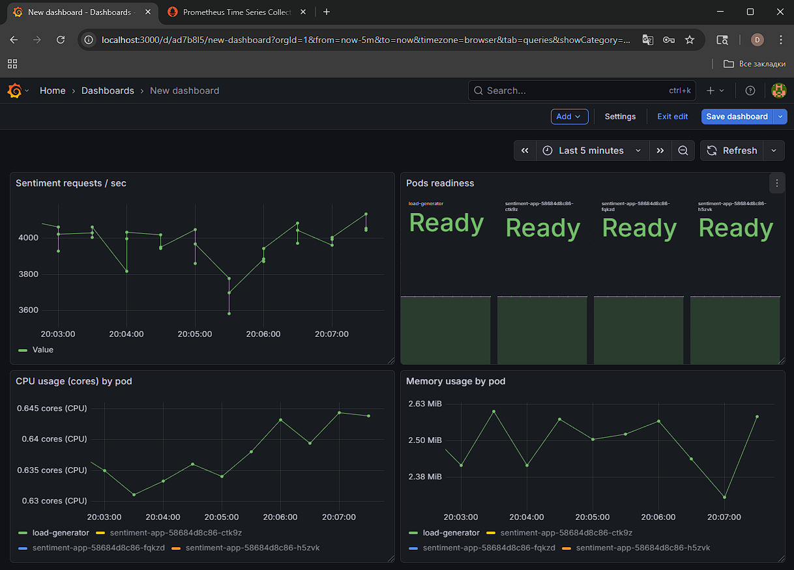

---

## 7. Анализ тенденций (arxiv.org, 2024–2025 гг.)

### 7.1. Выбору литературы

Для анализа актуальных трендов были отобраны работы на arXiv за **2024–2025 гг.** по темам:

* **AI-подходы в оркестрации** (scheduling / rescheduling) и **автоскейлинге**;
* **serverless-исполнение** и борьба с **cold-start**;
* **инференс LLM** и инфраструктура вокруг него (маршрутизация, кэширование, GPU-гетерогенность);
* связь с Kubernetes/контейнерами (включая HPA, метрики, симуляторы, политики).

---

### 7.2. Сводная таблица выбраных исследованных работ

| № | Название                                                                                                          | Авторы                      | Год  | Тематика                                                      | Ключевые результаты                                                                                                                                                                                                                                                                                       |
| - | ----------------------------------------------------------------------------------------------------------------- | --------------------------- | ---- | ------------------------------------------------------------- | --------------------------------------------------------------------------------------------------------------------------------------------------------------------------------------------------------------------------------------------------------------------------------------------------------- |
| 1 | *Streamlining Resilient Kubernetes Autoscaling with Multi-Agent Systems via an Automated Online Design Framework* | J. Soulé и др.              | 2025 | **Multi-agent** подход к HPA-автоскейлингу и устойчивости     | Авторы предлагают HPA-MAS (Multi-Agent System): декомпозиция цели “устойчивость к сбоям” на под-цели (в т.ч. при DDoS), обучение агентов в **digital twin** по трассам кластера и перенос политики в реальный кластер. ([arXiv][1])                                                                       |
| 2 | *Multi-Level ML Based Burst-Aware Autoscaling for SLO Assurance and Cost Efficiency* (BAScaler)                   | C. Meng и др.               | 2024 | Burst-aware автоскейлинг с ML + RL                            | BAScaler различает “периодические пики” и “реальные bursts”, при bursts **заранее завышает** прогноз и выделяет ресурсы, а вне bursts использует **reinforcement learning** для коррекции оценок. В экспериментах: снижение SLO-нарушений и экономия ресурсов относительно базовых подходов. ([arXiv][2]) |
| 3 | *AIBrix: Towards Scalable, Cost-Effective Large Language Model Inference Infrastructure*                          | AIBrix Team (J. Shan и др.) | 2025 | Cloud-native инфраструктура инференса LLM (Kubernetes-native) | Платформа для LLM-инференса с **LLM-специфичным autoscaling**, prefix/load-aware routing, distributed KV cache; гибридная оркестрация: Kubernetes (крупнозернистая) + Ray (тонкая). Отмечены улучшения throughput/latency за счёт кэширования и оркестрации. ([arXiv][3])                                 |
| 4 | *KIS-S: A GPU-Aware Kubernetes Inference Simulator with RL-Based Auto-Scaling*                                    | G. Zhang и др.              | 2025 | GPU-инференс в Kubernetes: симулятор + RL-автоскейлер         | KIS-S объединяет GPU-aware симулятор (KISim) и PPO-автоскейлер (KIScaler), который учится **в симуляции** и затем разворачивается без переобучения. Упор на GPU-метрики и bursty-нагрузку, где CPU-ориентированный HPA часто неадекватен. ([arXiv][4])                                                    |
| 5 | *Taming Cold Starts: Proactive Serverless Scheduling with Model Predictive Control*                               | C. Nguyen и др.             | 2025 | Serverless scheduling: proactive mitigation cold-start        | MPC-подход (Model Predictive Control) совместно оптимизирует **prewarming контейнеров** и **dispatch запросов** по прогнозу будущих вызовов. Реализация на Apache OpenWhisk в Kubernetes-тестбеде; заявлено существенное снижение tail-latency и накладных расходов. ([arXiv][5])                         |

---

### 7.3. Детальный анализ ключевых тенденций

#### 7.3.1. От “порогов” к адаптивному AI-автоскейлингу: bursts, устойчивость, multi-agent

**BAScaler (2024)** показывает практический вектор развития HPA-подобных механизмов:

* проблема не в самом “масштабировании”, а в том, что нагрузка **неровная** (bursty), а SLO (Service Level Objective) — жёсткий;
* поэтому важны **распознавание bursts** и разная стратегия “burst vs non-burst”, плюс RL-коррекция ошибок оценивания. ([arXiv][2])

**HPA-MAS (2025)** развивает тему уже не как “одна умная политика”, а как **набор кооперативных агентов**, каждый из которых оптимизирует свою под-цель устойчивости (например, при деградациях/крашах/атакующих сценариях). Важный инженерный момент: авторы прямо закладывают **digital twin по трассам кластера** и перенос обученных политик в реальную среду. ([arXiv][1])

**Связь с вашим стендом, Инженер Берёза.**
Если сейчас в учебном Kubernetes используется классический HPA на метриках уровня CPU/Memory, то логичный “шаг в будущее” (даже без полноценного ML в проде) — сделать инфраструктуру, совместимую с такими подходами:

* собирать **кластерные трассы** (Prometheus) и хранить их как датасет;
* перейти к HPA v2 / external metrics: latency, RPS, error-rate;
* тестировать политики сначала на “песочнице”/симуляции, затем переносить.

---

#### 7.3.2. LLM-инференс в Kubernetes: autoscaling, маршрутизация, кэширование и GPU-метрики

**AIBrix (2025)** фиксирует важный тренд: в LLM-сценариях “просто поднять pods и включить HPA” недостаточно. Нужны:

* LLM-специфичные политики масштабирования (в т.ч. сглаживание метрик и быстрые реакции),
* умная маршрутизация (учёт префикса, кэша, стоимости вычислений),
* системные оптимизации (distributed KV cache),
* и даже гибридная оркестрация Kubernetes + Ray. ([arXiv][3])

**KIS-S (2025)** подчеркивает, почему CPU-ориентированные метрики ломаются на GPU-инференсе: bottleneck может быть в GPU-очередях/памяти/акселераторе, а не в CPU. Поэтому авторы строят GPU-aware симулятор и учат RL-автоскейлер в симуляции, затем разворачивают без retraining. ([arXiv][4])

**Связь с проектом.**
Даже если текущее приложение не использует LLM/GPU, архитектурно это полезно как “вектор развития”:

* сервисы уже контейнеризованы → можно добавлять отдельный inference-service;
* мониторинг Prometheus/Grafana → можно расширять метрики под latency/token-throughput;
* в будущем возможна миграция в KServe/Knative-подобные паттерны (serverless inference) и внедрение cache-aware routing идей.

---

#### 7.3.3. Serverless и cold-start: переход к proactive scheduling

**Taming Cold Starts (2025)** показывает тренд “управления будущим”: вместо реактивного масштабирования — **прогноз + оптимизация**. MPC-контроллер по прогнозу вызовов:

* решает, сколько контейнеров прогреть заранее,
* и как диспетчеризовать запросы, чтобы уменьшить cold-start без избыточных ресурсов. ([arXiv][5])

**Связь с проектом.**
Если рассматривать ваш Minikube-стенд как модель “малого продакшена”, то именно cold-start-класс задач хорошо демонстрируется даже в учебной среде:

* легко воспроизвести bursty-нагрузку (тест-генератор),
* измерить p95/p99 latency,
* сравнить “reactive HPA” vs “prewarming/прогноз”.

---

### 7.4. Итоговые тенденции и рекомендации

**Основные тенденции (2024–2025):**

1. **Интеллектуальный автоскейлинг**: bursts + SLO-ориентация + RL-коррекция вместо “одного порога”. ([arXiv][2])
2. **Устойчивость как цель оркестрации**: multi-agent подходы, цифровые двойники по трассам, перенос политик в реальный кластер. ([arXiv][1])
3. **LLM-инференс требует специализированной инфраструктуры** (маршрутизация, кэш, autoscaling “по-умному”, гибридная оркестрация). ([arXiv][3])
4. **GPU-aware управление ресурсами**: метрики и политики должны учитывать GPU-узкие места, а симуляция становится ключевым инструментом разработки автоскейлеров. ([arXiv][4])
5. **Proactive serverless scheduling**: прогнозирование + управление prewarming для снижения cold-start и tail-latency. ([arXiv][5])

**Практические рекомендации для нашего стенда:**

* Зафиксировать текущий HPA как baseline и добавить экспериментальный контур: **external metrics** (latency/RPS/error-rate) → это подготовит почву для AI-подходов.
* Начать собирать “трассы нагрузки” как датасет (Prometheus) и описать это как шаг к **digital twin**, по аналогии с работой про HPA-MAS.
* Отдельно отметить “вектор развития”: LLM-инференс в Kubernetes (AIBrix-подход) и GPU-aware autoscaling (KIS-S) — как дальнейшее расширение архитектуры без переделки базовой контейнерной части.
* В качестве демонстрационного исследования добавить сценарий “bursty-нагрузки и cold-start”, где сравнить реактивный подход и prewarming-идею (по мотивам MPC-scheduler).

---

# 8. Заключение

## 8.1. Достигнутые результаты

- Подготовлено и запущено Java-приложение, реализующее:
  - `GET /api/sentiment?text=...` — обработка запроса и выдача результата
  - `GET /health` — endpoint проверки состояния сервиса
  - `GET /metrics` — экспорт метрик в формате Prometheus
- Выполнена контейнеризация приложения:
  - создан Dockerfile и собран Docker-образ приложения
  - выполнена локальная проверка запуска контейнера и работоспособности API
- Развёрнут Kubernetes-кластер в Minikube и подготовлена базовая инфраструктура:
  - включены необходимые компоненты кластера (Ingress, сбор метрик для autoscaling)
  - выполнена проверка состояния кластера (`kubectl get nodes/pods`)
- Приложение развернуто в Kubernetes:
  - `Deployment` приложения и запуск нескольких реплик
  - `Service` для доступа к приложению внутри кластера
  - `Ingress` для маршрутизации входящего трафика
  - `HPA` (Horizontal Pod Autoscaler) — подтверждена работа масштабирования по CPU под нагрузкой
- Настроен мониторинг и наблюдаемость:
  - установлен стек Prometheus + Grafana (kube-prometheus-stack)
  - подключен Prometheus datasource в Grafana и проверено получение метрик
  - создан Grafana-дашборд с панелями:
    - **Sentiment requests / sec**
    - **CPU usage (cores) by pod**
    - **Memory usage by pod**
    - **Pods readiness**
- Анализ тенденций (arXiv, 2024–2025)

## 8.2. Трудности и решения

## 8.2. Трудности и решения

| Трудность | Описание | Решение |
|---|---|---|
| Установка Docker в Ubuntu VM | На этапе установки возникали расхождения в ожидаемом/фактическом выводе команд и сомнения в корректности установки. | Установил Docker и проверил работоспособность через базовые команды (`docker version`, `docker ps`). Работу выполнял через SSH из VSCode — это не влияет на результат, если команды выполняются на целевой VM. |
| Ограничение ресурсов VM/Minikube | Был риск, что выделенных ресурсов (память/CPU/диск) не хватит для мониторинга и приложения (типичный симптом — Pending/OOM/нестабильный старт). | Оставил текущие ресурсы, т.к. кластер и мониторинг запустились. Зафиксировал правило: при Pending/OOM — увеличивать RAM/CPU/диск VM и перезапускать Minikube. |
| Включение необходимых аддонов Minikube | Без необходимых аддонов часть функциональности кластера не проверялась (Ingress/HPA/метрики). | Включил требуемые аддоны (в первую очередь `ingress`, `metrics-server`), после чего Ingress и HPA стали работоспособны и проверяемы. |
| Grafana/Prometheus: проверка источника данных | Требовалось убедиться, что Grafana действительно получает данные из Prometheus. | Настроил Prometheus datasource в Grafana, выполнил `Save & Test`, проверил метрики через Explore (например, `up`). |
| Grafana “No data” в панели CPU | Запросы по CPU не возвращали данные из-за несовпадения метрик/лейблов и неверной фильтрации. | Через Prometheus UI проверил наличие метрики и реальные labels, после чего использовал рабочий PromQL для CPU по pod’ам: `sum by (pod) (rate(container_cpu_usage_seconds_total{cpu="total", pod=~"sentiment-app-.*|load-generator"}[1m]))`. |
| Grafana “No data” в панели Memory (первый вариант) | Простой запрос по памяти не попадал в нужные series/pod’ы. | Перешёл на `container_memory_working_set_bytes` и добавил корректные фильтры: `sum by (pod) (container_memory_working_set_bytes{namespace="default", pod=~"sentiment-app-.*|load-generator", id=~"/kubepods.*"})`. |
| Некорректное отображение readiness (“нет time field”) | Панель readiness отображалась неверно из-за неподходящего типа данных/агрегации по времени. | Использовал метрику kube-state-metrics и time-агрегацию: `avg_over_time(kube_pod_status_ready{namespace="default", condition="true"}[1m])`, после чего статусы начали отображаться корректно. |
| Метрики “не меняются” без нагрузки | Без генерации запросов метрика `sentiment_requests_total` почти не менялась, графики выглядели статичными. | Запустил `load-generator`, который циклически отправляет запросы к сервису — метрики стали динамичными, появилась нагрузка для наблюдения поведения HPA. |
| Ошибка `AlreadyExists` при повторном запуске load-generator | При повторном создании pod с тем же именем Kubernetes возвращал `AlreadyExists`. | Удалял существующий pod перед повторным запуском (`kubectl delete pod load-generator`) либо запускал под другим именем. |

## 8.3. Перспективы развития

- Перейти от rule-based логики к ML/LLM-подходу: обучаемая модель тональности (эмбеддинги, fine-tuning или внешнее API), а также добавление метрик качества (precision/recall/F1) и тестового датасета для регрессионной проверки.
- Повысить производительность и устойчивость: кэширование результатов `/api/sentiment` (например, Redis) + ограничение частоты запросов (rate limiting) и базовая защита от перегрузки.
- Автоматизировать поставку: CI/CD (GitHub Actions / GitLab CI) — сборка и проверка (tests/lint), публикация Docker-образа в registry, деплой в Kubernetes по тегам/релизам.
- Улучшить наблюдаемость: распределённый трейсинг (Jaeger или Grafana Tempo) и сквозная корреляция логов/метрик через `traceId` (единый идентификатор трассировки).
- Усилить сетевую безопасность и контроль трафика: внедрение service mesh (Istio или Linkerd) для mTLS (mutual TLS — взаимная аутентификация), политик доступа, ретраев/таймаутов и продвинутой телеметрии.
- Ввести эксплуатационные практики: алёрты (Alertmanager), SLO/SLI (Service Level Objective / Service Level Indicator — целевые уровни сервиса и измеримые показатели), отдельный дашборд “Golden Signals” (latency/traffic/errors/saturation) и сценарии реагирования (runbooks).

---

# 9. Список использованных источников

## 9.1. Документация

1. Minikube: https://minikube.sigs.k8s.io/docs/start/
2. Kubernetes Docs: https://kubernetes.io/docs/home/
3. Helm: https://helm.sh/docs/
4. kube-prometheus-stack: https://github.com/prometheus-community/helm-charts/tree/main/charts/kube-prometheus-stack
5. Grafana: https://grafana.com/docs/
6. Prometheus (PromQL): https://prometheus.io/docs/prometheus/latest/querying/basics/
7. Kubernetes HPA: https://kubernetes.io/docs/tasks/run-application/horizontal-pod-autoscale/

## 9.2. Научные работы (arXiv, 2024–2025)

1. Streamlining Resilient Kubernetes Autoscaling with Multi-Agent Systems via an Automated Online Design Framework: https://arxiv.org/abs/2505.21559
2. Multi-Level ML Based Burst-Aware Autoscaling for SLO Assurance and Cost Efficiency: https://arxiv.org/abs/2402.12962
3. AIBrix: Towards Scalable, Cost-Effective Large Language Model Inference Infrastructure: https://arxiv.org/abs/2504.03648
4. KIS-S: A GPU-Aware Kubernetes Inference Simulator with RL-Based Auto-Scaling: https://arxiv.org/abs/2507.07932
5. Taming Cold Starts: Proactive Serverless Scheduling with Model Predictive Control: https://arxiv.org/abs/2508.07640

---